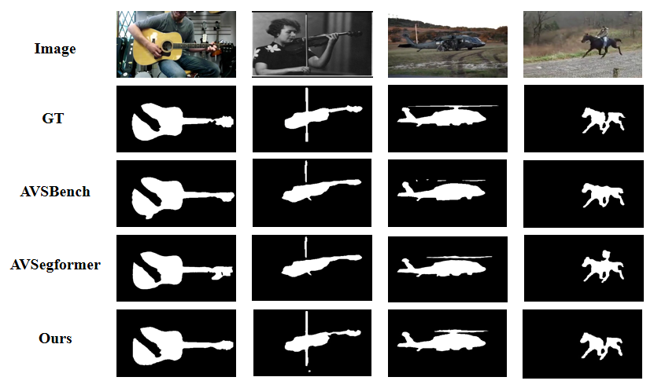

# 💬Stepping-Stones
**Please refer to the official [repo](https://github.com/GeWu-Lab/Stepping-Stones) and [project page](https://gewu-lab.github.io/stepping_stones/)**

Audio-Visual Segmentation (AVS) aims to achieve pixel-level localization of sound sources in videos, while Audio-Visual Semantic Segmentation (AVSS), as an extension of AVS, further pursues semantic understanding of audio-visual scenes. However, since the AVSS task requires the establishment of audio-visual correspondence and semantic understanding simultaneously, we observe that previous methods have struggled to handle this mashup of objectives in end-to-end training, resulting in insufficient learning and sub-optimization. Therefore, we propose a two-stage training strategy called Stepping Stones, which decomposes the AVSS task into two simple subtasks from localization to semantic understanding, which are fully optimized in each stage to achieve step-by-step global optimization. This training strategy has also proved its generalization and effectiveness on existing methods. To further improve the performance of AVS tasks, we propose a novel framework Adaptive Audio Visual Segmentation, in which we incorporate an adaptive audio query generator and integrate masked attention into the transformer decoder, facilitating the adaptive fusion of visual and audio features.  Extensive experiments demonstrate that our methods achieve state-of-the-art results on all three AVS benchmarks. 

## 📰 News
- (2024.04.16) Upload the main code.
- (2024.04.11) Upload README.

## ✊ Todo
- [x] Upload README.
- [x] Upload the code.
- [ ] Upload checkpoints.
- [ ] Update the README and introduce the implementation details. 

## 💡 Result
### Quantitative comparision
| Method            | S4    |          | MS3   |          | AVSS  |          | Reference |
|-------------------|-------|----------|-------|----------|-------|----------|-----------|
|                   | *mIoU*  | *F-score*  | *mIoU*  | *F-score* | *mIoU* | *F-score*  |           |
| AVSBench          | 78.74 | 87.9     | 54.00 | 64.5     | 29.77 | 35.2     | ECCV'2022 |
| AVSC              | 80.57 | 88.19    | 58.22 | 65.10    | -     | -        | ACM MM'2023 |
| CATR              | 81.40 | 89.60    | 59.00 | 70.00    | 32.80 | 38.50    | ACM MM'2023 |
| DiffusionAVS      | 81.38 | 90.20    | 58.18 | 70.90    | -     | -        | Arxiv'2023 |
| ECMVAE            | 81.74 | 90.10    | 57.84 | 70.80    | -     | -        | CVPR'2023 |
| AuTR              | 80.4  | 89.1     | 56.2  | 67.2     | -     | -        | Arxiv'2023 |
| SAMA-AVS          | 81.53 | 88.6     | 63.14 | 69.1     | -     | -        | WACV'2023 |
| AQFormer          | 81.60 | 89.40    | 61.10 | 72.10    | -     | -        | IJCAI'2023 |
| AVSegFormer       | 82.06 | 89.90    | 58.36 | 69.30    | 36.66 | 42.00    | AAAI'2024 |
| AVSBG             | 81.71 | 90.4     | 55.10 | 66.8     | -     | -        | AAAI'2024 |
| GAVS              | 80.06 | 90.2     | 63.70 | 77.4     | -     | -        | AAAI'2024 |
| MUTR              | 81.5  | 89.8     | 65.0  | 73.0     | -     | -        | AAAI'2024 |
|**AAVS(Ours)**        | **83.18** | **91.33** | **67.30** | **77.63** | 41.28 | 46.33    | -         |
|**AAVS**$^*$**(Ours)**  | -     | -        | -     | -        | **48.50** | **53.20** | -         |

>  $^∗$ indicates that the model uses the Stepping Stones strategy.
### Quantitative comparision

Single Sound Source Segmentation(S4): 

Multiple Sound Source Segmentation(MS3):

Audio-Visual Semantic Segmentation(AVSS):

### Generalization of Stepping Stones training strategy
| Method       | Origin mIoU | Origin F-score | w/.SS (*high*) mIoU | w/.SS (*high*) F-score | w/.SS (*oracle*) mIoU | w/.SS (*oracle*) F-score |
|--------------|-------------|----------------------|---------------------|------------------------|-----------------------|--------------------------|
| AVSBench | 29.77| 35.2 | 31.48| 34.89| 36.35 | 39.01     |
| AVSegformer| 36.66       | 42.0           | 39.44   | 42.49 | 46.27    | 48.04         |
>  *high* and *oracle* corresponded to three levels of mIoU values of the first stage results.

AVSBench:

AVSegformer:

